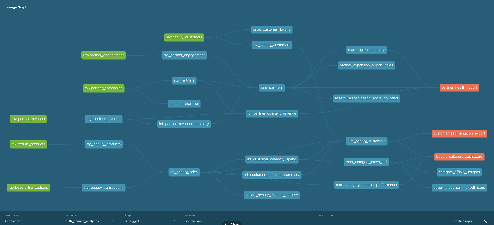

# Multi-Domain Analytics — dbt Portfolio

A production-style dbt project modeling two distinct business domains: **Beauty Retail** (B2C product analytics) and **Partner Channel** (B2B platform analytics). Demonstrates dimensional modeling, incremental processing, SCD Type 2 snapshots, data quality testing, and CI/CD across different data contexts.



## Architecture

```
seeds (raw CSVs)
  → staging (cleaned, typed, standardized)
    → intermediate (shared aggregation logic, ephemeral)
      → marts (star schema: facts + dimensions + analytical models)
        → exposures (downstream dashboards + ML pipelines)

snapshots (SCD Type 2: loyalty tier + partner tier history)
```

### Beauty Retail Domain
Models inspired by category analytics across Haircare, Fragrance, and Skincare.

| Layer | Model | Type | What it does |
|-------|-------|------|-------------|
| Staging | `stg_beauty_customers` | view | Cleaned customers with metro area derivation |
| Staging | `stg_beauty_products` | view | Products with margin calc and price tier |
| Staging | `stg_beauty_transactions` | view | Transactions with net revenue and time dimensions |
| Intermediate | `int_customer_purchase_summary` | ephemeral | Customer-level lifetime aggregation (DRY) |
| Intermediate | `int_customer_category_spend` | ephemeral | Customer × category spend matrix (DRY) |
| Mart | `fct_beauty_sales` | **incremental** | Enriched transactions — only processes new rows |
| Mart | `dim_beauty_customers` | table | Lifetime value, cross-sell affinity, discount sensitivity, lifecycle status |
| Mart | `mart_category_cross_sell` | table | Category pair affinity with bundle opportunity scoring |
| Mart | `mart_category_monthly_performance` | table | MoM trends, online share, seasonal patterns |
| Snapshot | `snap_customer_loyalty` | SCD2 | Tracks loyalty tier changes over time |

### Partner Channel Domain
Models inspired by building a multi-region unified data model for partner analytics.

| Layer | Model | Type | What it does |
|-------|-------|------|-------------|
| Staging | `stg_partners` | view | Partners with region grouping and tenure |
| Staging | `stg_partner_revenue` | view | Revenue normalized to USD |
| Staging | `stg_partner_engagement` | view | Usage events standardized |
| Intermediate | `int_partner_revenue_summary` | ephemeral | Revenue aggregation with concentration metrics (DRY) |
| Mart | `dim_partners` | table | Health score, churn risk, revenue efficiency |
| Mart | `fct_partner_quarterly_revenue` | table | QoQ growth by partner × product × region |
| Mart | `mart_region_summary` | table | Cross-region executive view |
| Snapshot | `snap_partner_tier` | SCD2 | Tracks partner tier changes over time |

## Key Patterns Demonstrated

| Pattern | Where | Why it matters |
|---------|-------|---------------|
| **Incremental materialization** | `fct_beauty_sales` | Production-scale: only processes new rows, not full rescans |
| **SCD Type 2 snapshots** | `snap_customer_loyalty`, `snap_partner_tier` | Historical state tracking for accurate cohort analysis |
| **Intermediate (ephemeral) models** | `int_customer_*`, `int_partner_*` | DRY: shared aggregation logic used by multiple marts |
| **Custom generic tests** | `metric_not_negative`, `metric_variance` | Reusable data quality patterns across any domain |
| **Exposures** | 3 defined | Shows data lineage from models to business tools |
| **Composite scoring** | `dim_partners.health_score` | Multi-signal business logic in SQL |
| **Churn risk classification** | `dim_partners.risk_status` | Actionable segmentation from data signals |
| **Cross-sell affinity** | `mart_category_cross_sell` | Analytical model with bundle opportunity scoring |

## Stack

- **dbt Core** — transformations, testing, snapshots, documentation
- **DuckDB** — local analytical database (zero infrastructure)
- **GitHub Actions** — CI pipeline (seed → run → test on every push)

## Quick Start

```bash
python3 -m venv venv && source venv/bin/activate
pip install dbt-core dbt-duckdb
dbt deps
dbt seed
dbt snapshot
dbt run
dbt test
dbt docs generate && dbt docs serve
```

## Data Quality

- **30+ tests** across sources, staging, and mart layers
- **Source tests**: uniqueness, referential integrity, accepted values
- **Schema tests**: not_null, unique, relationships, accepted_values on mart columns
- **Custom singular tests**: positive revenue, health score bounds, cross-sell no self-pairs
- **Custom generic tests**: `metric_not_negative` (reusable), `metric_variance` (anomaly detection)
- **Exposures**: 3 downstream consumers defined (dashboards + ML export)

## Analyses

- `category_affinity_insights.sql` — Which beauty categories drive cross-sell revenue?
- `partner_expansion_opportunities.sql` — Which partners are engaged but under-adopted?

## Sample Insights (from actual model output)

**Beauty Retail:**
- **Skincare dominates** at $2,808 total revenue (44% share) with 10 unique customers and 75% gross margin
- **Occasional discount users have 2.4x higher LTV** ($301) than full-price buyers ($125) — and nearly 3x more transactions. This challenges the assumption that discounts erode value; strategic discounting drives repeat purchases
- **Repeat buyers spend 3.9x more** ($205 avg LTV) than one-time buyers ($53) — retention is the #1 revenue lever

**Partner Channel:**
- **Americas leads** with avg health score 61.4, while APAC lags at 47.5 — suggesting regional engagement strategies need differentiation
- **93% of partners show risk signals** (high or medium risk) — driven by low product-line adoption and inconsistent engagement, not revenue decline. This is an early-warning signal that revenue-only dashboards would miss

## Code Quality

- **SQLFluff** configured for consistent SQL style (lowercase keywords, explicit aliasing, trailing commas)
- **CI pipeline** runs `dbt seed → run → test` on every push via GitHub Actions
- See [CONTRIBUTING.md](CONTRIBUTING.md) for coding standards and how to extend the project

## Design Decisions

See [docs/decisions.md](docs/decisions.md) for rationale on:
- Star schema vs OBT
- Why incremental for facts
- Why ephemeral intermediates
- Health score weighting
- Churn risk classification
- Data quality philosophy
